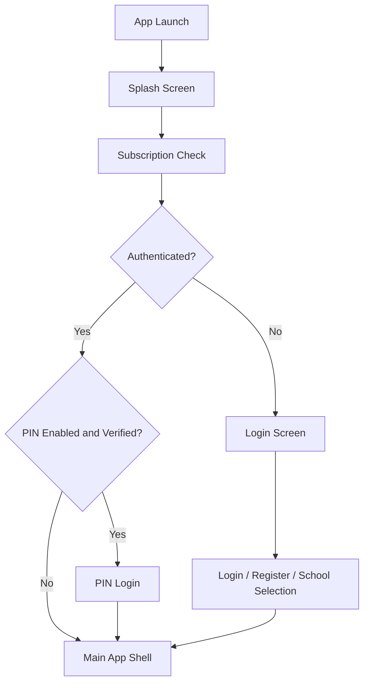

# DriveSync Pro — UI/UX and Application Flow Documentation

This document describes the current application as implemented in the codebase. It focuses on the interface structure, visual behavior, and the user flow that is actually present in the app, rather than on speculative product ideas.

---

## 1. Product Scope at a Glance

DriveSync Pro is a multi-role driving school management application. The interface is organized around a single-shell experience where users move between operational modules such as dashboard, students, instructors, courses, schedules, billing, receipts, POS, reports, and settings.

The app is designed for:
- School administrators
- Instructors
- Students
- Subscription-gated access

The UI is responsive and adapts between:
- Mobile layout with a drawer and compact top bar
- Desktop layout with a persistent sidebar and top bar
- Embedded in-shell views for details and secondary workflows

---

## 2. Core UX Characteristics

### 2.1 Visual Style
The app uses a modern Material 3 style with:
- A blue primary palette
- Teal accents
- A dark and light theme system
- Rounded cards, buttons, and form containers
- Elevated surfaces for content separation
- Soft shadows and outline borders on key containers

### 2.2 Information Architecture
The experience is centered around one primary shell with a persistent navigation structure. The main content area changes based on the current module, while the shell itself remains consistent.

### 2.3 Interaction Style
The UI heavily relies on:
- Smooth transitions between screens
- Snackbars for feedback
- Loading indicators during async work
- Confirmation dialogs for destructive actions
- Sticky headers for long lists
- Search and filter bars inside content modules

---

## 3. Screen Inventory

The following is the current screen inventory derived from the implementation in the codebase. This is the list of screens and screen-like views that the app actually contains today.

| Area | Screen / View | Purpose | Notes |
| --- | --- | --- | --- |
| Startup | Splash Screen | App launch initialization and route selection | Displays branding, loading progress, and startup status |
| Startup | Subscription Check Screen | Verifies subscription state before allowing access | Shows loading, retry, or blocked states |
| Auth | Login Screen | Email/password sign-in | Main authentication entry point |
| Auth | PIN Login Screen | Fast PIN-based sign-in | Used when PIN is enabled and verified |
| Auth | PIN Setup Screen | Configure or update PIN | Used during setup or account settings |
| Auth | School Selection Screen | School onboarding selection | Lets the user choose the school route |
| Auth | School Registration Screen | Create a new school account | Registration and trial onboarding flow |
| Shell | Responsive Main Layout | Primary application shell | Provides sidebar/drawer, top bar, and content switching |
| Dashboard | Fixed Dashboard Content | Main home/dashboard experience | Shows summary statistics and activity insights |
| Users | Enhanced Users Screen | Student/instructor/admin user management list | Supports search, filters, selection, and detail entry |
| Users | Add User Screen | Create a new user | Used inside the shell as an embedded workflow |
| Users | Bulk Student Upload Screen | Bulk import students | CSV-style onboarding workflow |
| Users | Student Details Screen | Detailed student profile and actions | Opens from the user list |
| Users | Instructor Details Screen | Detailed instructor profile and actions | Opens from the instructor list |
| Users | Graduation Screen | Graduation workflow for students | Used from the student management flow |
| Users | Alumni Screen | Alumni management view | Separate user-management module |
| Users | Enhanced Recommendations Screen | Recommended actions and guidance | Used as a secondary tab within user screens |
| Courses | Course Screen | Course listing and management | Includes search, filters, stats, and recommendations |
| Courses | Course Details Screen | Course detail workflow | Opens from the course list |
| Fleet | Fleet Screen | Vehicle/fleet listing and management | Main fleet overview |
| Fleet | Fleet Details Screen | Vehicle detail workflow | Opens from fleet list |
| Schedules | Schedule Screen | Schedule management | Core scheduling interface |
| Schedules | Simplified Schedule Booking Screen | Scheduling/booking workflow | Embedded booking experience |
| Schedules | Recurring Schedule Screen | Recurring schedule creation | Embedded recurring-schedule workflow |
| Billing | Billing Screen | Billing and invoice management | Main billing module |
| Billing | Student Invoice Screen | Invoice detail workflow | Opens from billing context |
| Payments | POS Screen | Point-of-sale workflow | Payment-related operational flow |
| Payments | Payments Screen | Payment screen container | Present in the payment module structure |
| Receipts | Receipt Management Screen | Receipt handling and management | Finance-supporting screen |
| Reports | Reports Screen | Reports landing/entry screen | General reports access |
| Reports | Financial Reports Screen | Financial reporting view | Finance reporting module |
| Reports | Users Reports Screen | User reporting view | User-related reporting module |
| Reports | Course Reports Screen | Course-based reporting view | Course reporting module |
| Profile | Profile Screen | User profile and account settings | Personal info and account actions |
| Settings | Settings Screen | App settings | General app configuration |
| Settings | Main Settings Screen | Settings container/shell entry | Settings module entry |
| Settings | Subscription Settings Screen | Subscription configuration view | Subscription-related setting screen |
| Search | Quick Search Screen | Global/quick search experience | Accessible from the shell toolbar |
| Sync | Sync Status Widget / Sync Screen | Sync status and synchronization UI | Used in the shell header and sync-related flow |
| Diagnostics | Sync Diagnostic Screen | Diagnostic view for sync issues | Troubleshooting-oriented screen |
| Fallback | Not Found / Login fallback | Fallback route handling | Used when an unknown route is encountered |

### Screen categories by user journey

- Authentication journey: Splash, Subscription Check, Login, PIN Login, PIN Setup, School Selection, School Registration
- Main app journey: Responsive Main Layout, Dashboard, Profile, Settings
- Management journey: Users, Courses, Fleet, Schedules, Billing, Receipts, POS, Reports
- Support journey: Quick Search, Sync Status, Sync Diagnostics

---

## 4. Overall Application Flow

The user journey is structured in layers:

1. App startup
2. Subscription and auth checks
3. Authentication or PIN login
4. Main app shell
5. Module navigation
6. Detail and action flows

### 3.1 High-Level Flow

---

## 4. Startup and Entry Experience

### 4.1 Splash Screen
The first visible experience is a splash screen with:
- An animated logo pulse effect
- The app name, “DriveSync Pro”
- A tagline: “Drive Smarter, Manage Easier”
- A progress indicator and status text

The splash experience is not only decorative. It also:
- Initializes database-backed services
- Initializes app bindings
- Checks whether local users already exist
- Chooses the correct initial route based on the current auth and PIN state

### 4.2 Subscription Gate
Before entering the main application, the app performs a subscription validation step. If the subscription is suspended, expired, or a trial period has ended, a dedicated blocked screen appears instead of the dashboard.

This makes the app feel more controlled and enterprise-oriented, with a hard access barrier before the main experience opens.

### 4.3 App Entry Decision Logic
The startup flow selects one of the following routes:
- Login screen
- PIN login screen
- Main application shell

The app does not assume a single first-run path; it checks current state before choosing the destination.

---

## 5. Authentication and Identity Flow

### 5.1 Login Screen
The login experience is a centered, card-based form with:
- App logo at the top
- “Welcome Back” header
- Email field
- Password field with show/hide toggle
- Remember-me checkbox
- Login action
- Error message area
- Register link
- Offline information note

UX notes:
- The screen uses a large, soft card on a gradient background.
- The form is optimized for readability and mobile friendliness.
- The available actions are easy to scan and placed in a clear vertical order.

### 5.2 PIN Login Screen
When PIN login is enabled and previously verified, the app uses a dedicated PIN entry screen.

This screen presents:
- A four-digit PIN entry experience
- Focused numeric input fields
- Shake animation for wrong PIN attempts
- Loading state during verification
- Error messaging

Its UX is intentionally concise and fast for returning users.

### 5.3 PIN Setup Screen
The app also supports PIN configuration. This appears as a setup flow for establishing or changing a PIN. It is a clear, guided action that feels separate from the main business workflows.

### 5.4 School Registration and Selection
The app includes a school onboarding path for multi-school scenarios. There is a dedicated selection screen and a registration screen that support:
- Starting a new school registration
- Selecting an existing school path
- Entering school and account credentials

These screens are more onboarding-focused than task-focused and are designed to establish context before the main business experience begins.

---

## 6. Main Application Shell

Once the user is authenticated, the app enters a consistent shell that remains present while navigating between modules.

### 6.1 Responsive Shell Structure
The shell changes presentation based on viewport size:

#### Mobile
- A hamburger menu opens a drawer
- A compact top bar displays:
  - Menu icon
  - Current page title
  - Sync status icon
  - POS shortcut
  - Search shortcut

#### Desktop
- A fixed left sidebar contains navigation
- A top bar shows the current page title and utility actions
- The content area occupies the remaining space

### 6.2 Shell UX Patterns
The shell supports:
- Persistent context at the top or side
- Role-based navigation visibility
- Clear page title changes as users move through the app
- A consistent place for quick actions like POS and search
- A safe logout pattern with confirmation and loading dialog

### 6.3 Navigation Model
The app uses role-based navigation. The visible modules depend on whether the user is:
- Admin
- Instructor
- Student

For example:
- Admins see more modules, including finance, reports, management, and alumni.
- Instructors see teaching- and scheduling-oriented modules.
- Students see a more limited experience focused on their workspace and essentials.

---

## 7. Dashboard Experience

The dashboard is the home screen of the main application and is designed as a high-information overview.

### 7.1 Dashboard Layout
The dashboard content is organized into sections:
- Welcome section
- Statistics cards
- Quick actions
- Activity-based sections
- Engagement insights cards when enabled

### 7.2 Dashboard UX Patterns
The dashboard uses a vertical, scrollable composition with clear spacing between sections. It combines:
- Summary metrics
- Action-oriented shortcuts
- Real data-driven panels

The dashboard is not a placeholder screen. It renders actual operational data, including:
- Student count
- Income totals
- Unpaid invoices
- Active instructors

### 7.3 Dashboard Behaviors
The dashboard can show optional engagement insights such as:
- Instructor briefing
- Overdue board

These are presented as lightweight, data-driven cards that support operational awareness without overwhelming the page.

---

## 8. Core Module Flow

### 8.1 Students and Instructors Management
The user management experience is built around a reusable list-style screen with strong search and selection capabilities.

#### UX behaviors
- Search bar at the top
- Sticky header structure for quick access
- List of cards for individual users
- Multi-selection mode for bulk actions
- Bulk delete and graduation actions
- Floating action button for adding a new user

#### Flow
1. User opens the relevant list screen
2. Search or filter narrows down results
3. User can tap a card to open details
4. Long press or selection action can enable multi-select mode
5. Bulk actions appear in a context bar
6. A floating action button supports adding a new entry

This flow makes the screen feel efficient for handling large datasets and repeated operations.

### 8.2 Courses Module
The courses experience is more visual and structured than the user list screens.

#### UX behaviors
- Horizontal stat cards at the top
- Sticky search and controls
- Tabbed layout for different views
- Recommendation panels for analytics and management hints
- Cards representing each course

#### Flow
1. User sees top-level course statistics
2. User can search or filter courses
3. The list view shows course cards
4. Different tabs provide alternative views or recommendations
5. User can open course details from the list

This module feels more like a management dashboard than a simple list.

### 8.3 Schedules Module
The schedule experience is built around booking and recurring schedule management. It is designed to support operational planning rather than just display.

The UI supports:
- Schedule browsing
- Booking actions
- Recurring schedule creation
- Embedded workflow views inside the main shell

### 8.4 Billing and Finance
The billing experience is a finance-focused module for managing invoices and payments.

The app exposes:
- Billing screens
- Invoice-specific views
- Payments-related screens
- POS flow

These screens are linked from the main shell and appear as part of the finance section of the UI.

### 8.5 Reports Module
The reports experience is presented through dedicated report screens for:
- Financial reports
- User reports

The reports are exposed through the shell’s navigation and appear as a separate reporting section rather than as a generic content page.

### 8.6 Settings and Profile
The settings and profile areas are treated as supporting modules that preserve the same shell structure while offering account and configuration actions.

Profile flow includes:
- Personal information overview
- Account action list
- Password change flow
- PIN change flow

This keeps the app’s identity and account management in the same consistent shell rather than moving the user to a separate app experience.

---

## 9. Detailed Screen Flow Map

### 9.1 Authentication Flow
- App launches
- Splash initializes and decides route
- User is sent to login or PIN login if already known
- After successful auth, user enters main shell

### 9.2 Main Shell Navigation Flow
- User selects a module from the sidebar or drawer
- The content area updates to the relevant module screen
- Detail views open inside the main shell when the user selects a record
- The user can return to the list view or parent module through the shell’s navigation model

### 9.3 Detail-and-Return Flow
Several screens use an embedded detail pattern:
- Course details from course list
- Fleet details from fleet list
- Student details from user list
- Instructor details from instructor list
- Student invoice from billing or student selection
- Profile from user menu

This pattern keeps the user inside a single coherent app environment rather than forcing full-page transitions for every action.

---

## 10. Responsive UX Behavior

### 10.1 Mobile Experience
The mobile UX prioritizes simplicity and quick access:
- Drawer-based navigation
- Compact top bar with essential functions
- Large touch-friendly controls
- Scrollable content structure

### 10.2 Tablet and Desktop Experience
The larger layouts emphasize overview and efficiency:
- Persistent sidebar navigation
- Wider content area
- More visible page title and utility actions
- Better use of horizontal space for summaries and lists

### 10.3 Shared Responsive Principles
Across all layouts, the app favors:
- Clear page identity
- Persistent top-level navigation
- Consistent action placement
- Large tap targets for core interactions

---

## 11. Interaction Patterns and Feedback

### 11.1 Feedback Mechanisms
The app uses several visible feedback mechanisms:
- Snackbars for success and error notifications
- Progress indicators for async actions
- Loading dialogs for destructive operations
- Error states when data cannot be loaded

### 11.2 Confirmation and Safety
The app uses confirmation dialogs for:
- Logout
- Deletion or bulk deletion
- Sensitive account actions

This helps protect users from accidental destructive actions.

### 11.3 Empty and Error States
The UI includes empty-state handling such as:
- No results found states
- Access denied screens
- Error surfaces for failed loading or invalid states

These are not just placeholders; they provide clear recovery paths.

---

## 12. UX Strengths Observed in the Current Implementation

The current UI already shows several strong patterns:
- A clear separation between shell and content
- Role-based navigation that reduces clutter for different user types
- Strong support for responsive behavior
- Reusable list-management interactions
- A consistent visual system through Material 3 styling
- Embedded detail flows that preserve context

---

## 13. Notable UI/UX Notes

### 13.1 Strengths
- The app feels like a real operational management tool rather than a generic dashboard.
- The shell is consistent and predictable.
- The use of sticky headers, search, and selection tools improves large-data handling.
- The navigation model is fairly structured and role-aware.

### 13.2 Observed Design Direction
The UI tends to prioritize:
- Functionality over minimalism
- Data-centric workflows over marketing-style screens
- Clear operational visibility over visual simplicity alone

This makes the app suitable for daily school operations rather than casual browsing.

---

## 14. Summary

The application’s UI/UX is centered around a responsive, role-based, multi-module management shell. It is built around a strong operational workflow: start up, authenticate, enter the main shell, choose a module, act on records, and return to the main workspace.

The strongest UX elements in the current implementation are:
- A consistent shell
- A clear startup/auth flow
- Responsive navigation
- Search-and-action patterns for records
- Embedded detail workflows that keep users inside the app context

This document reflects the UI and flow present in the current implementation and avoids speculative additions beyond what is visible in the codebase.
